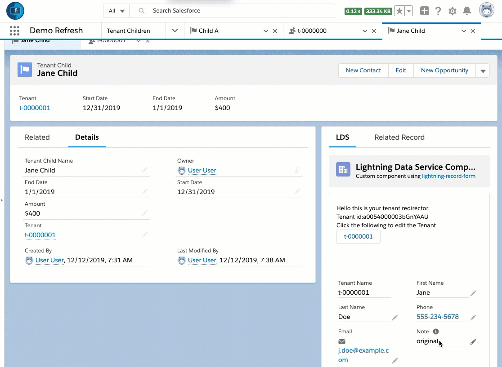
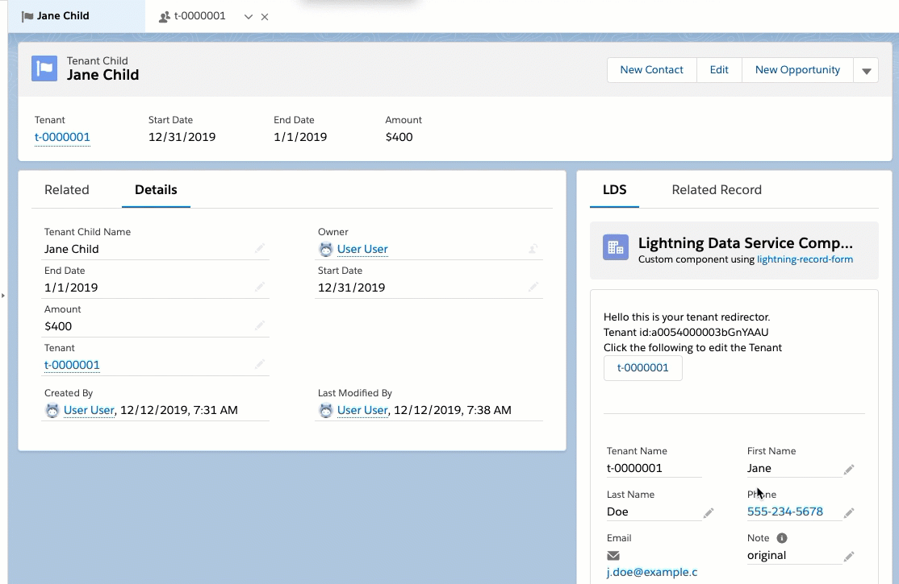
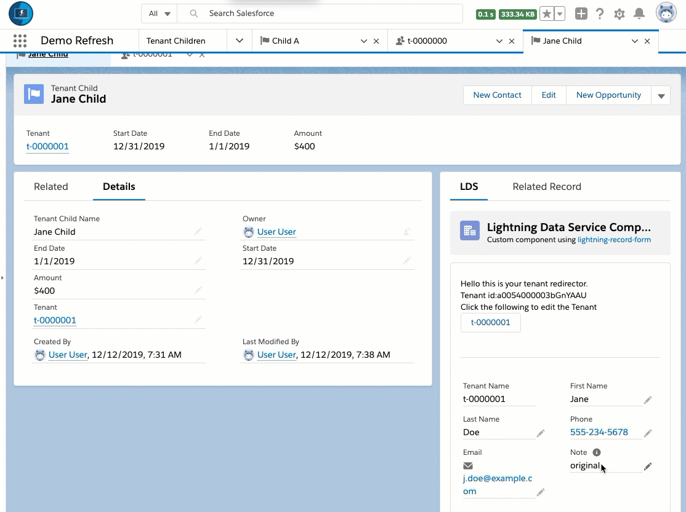
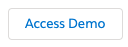
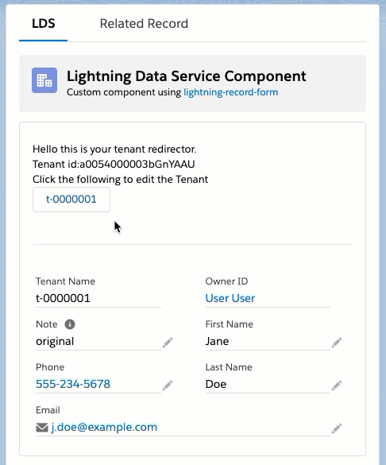

# Overview

Please see the [Installation](#install) section below for more on how to install on your Sandbox / Demo org.

**Please note: sample code (metadata api and dx formats) are is also available in the [mdapi](./mdapi) and [dx](./dx) folders above**

---

Overview

---

NOTE: This project is for demonstration purposes.
For more information, please see the [Licensing](#licensing) section below

# Demo

Is it possible to make sure that changes on a Parent Record appear updated on a child record.

Whether we make the change from the parent, and see it on the child...

... or whether we change it on the child in a lightning-record-form...

... or whether we change it in a new Edit popup...

With the Lightning Data Service, changes made within the same browser are available to other 'tabs' within Lightning Experience - so we always have the most up to date information.

----

NOTE: This project is for demonstration purposes.
For more information, please see the [Licensing](#licensing) section below

# How to Use

(Click below to access the short lived demo)

Note we have two objects within the `Demo Refresh` application:

* Tenant (base record)
* Tenant Child (child of Tenant)

From the Child Record, we can access and update information from the parent - while making sure the information is updated on the Parent Tab (even if it is open)

## Option 1 - Update the Lightning Record Form

Within the `LDS` tab on the `Tenant Child` record
- Simply click on the `Edit icon` next to the field (looks like a 'pencil')

Then update the Note of the parent Tenant.

Note that even if the parent Tenant record tab is open, it will remain in sync.

----

This component needs two things to work:

1. The related Tenant Id

2. A [Lightning Data Service component](https://developer.salesforce.com/docs/component-library/documentation/lwc/lwc.data_ui_api)

We can determine the related record using the @wire service, by using the 'recordId' and asking for the Tenant Id.

We then use that TenantId within the [lightning-record-form](https://developer.salesforce.com/docs/component-library/bundle/lightning-record-form/documentation) to show the form.

---

Because we update the record through the lightning-data-form, it will update using the Lightning Data Service - so the parent object's tab will also update.

## Option 2 - Update with the Edit Form

Within the `LDS` tab on the `Tenant Child` record
- simply click the button with the name of the Tenant to open the `Edit Form`.

Saving the change on the Edit Form will automatically update
on the child (within the Lightning Record Form) and on the Parent tab.
(All three remain in sync)

---

We navigate using the [NavigationMixin](https://developer.salesforce.com/docs/component-library/bundle/lightning-navigation/documentation)

Because this is the standard Edit Screen, we do not have a hook on completion to let the child know to refresh.

Yet because we are using the Lightning Data Service in how we access the information, it has the hook automatically to use the latest information from the local cache.

## Option 3 - Update on the parent Tenant

Within the `Tenant` record, make a change - such as updating the note.

Then navigate back to a related `Tenant Child` record.

Note that even without refreshing the screen (or calling a [lightning:refreshView event](https://developer.salesforce.com/docs/component-library/bundle/force:refreshView), the child has been updated using the Lightning Data Service.

---

Similar to Option 2, Because this is the standard Edit Screen, we do not have a hook on completion to let the child know to refresh.

Yet because we are using the Lightning Data Service in how we access the information, it has the hook automatically to use the latest information from the local cache.

## Option 4 - Update from Related Record

Within the `Related Record` tab on the `Tenant Child` record,
- Simply click on the `Edit icon` next to the field (looks like a 'pencil')

Then update the Note of the parent Tenant.

Note that even if the parent Tenant record tab is open, it will remain in sync.

We need two things for this to work:

1 A quick action on the object that we have an id for.

2 Use the standard Related Record component

In this case the Tenant object has a quick action that shows the fields we want.

As long as this record has the id of the other record, we can use that id with the Related Record component.

---

The [Related Record component](https://releasenotes.docs.salesforce.com/en-us/spring17/release-notes/rn_forcecom_lab_comp_related_record.htm) also uses the Lightning Data Service behind the scenes.

So the information is also shared with the detail on the Tenant Child and on the Tenant - parent record.

## Installing via the Salesforce CLI

This assumes you have already installed the [Salesforce CLI]() and [Connected the Salesforce CLI to your org](https://developer.salesforce.com/docs/atlas.en-us.sfdx_dev.meta/sfdx_dev/sfdx_dev_auth_web_flow.htm).

However, the Salesforce CLI can be used with any org and does not require Salesforce DX to be enabled. (Although enabling the DX / Dev Hub would give some great benefits, and would only require care of [certain object permissions: Scratch Org Info, ActiveScratchOrg, NamespaceRegistry](https://developer.salesforce.com/docs/atlas.en-us.sfdx_setup.meta/sfdx_setup/sfdx_setup_add_users.htm) - as they are not available in all orgs)

**1.** Run the following command:

	sfdx force:mdapi:deploy -d mdapi -u [[orgAlias]] -w

**2.** Add the permission set to your user

	sfdx force:user:permset:assign -n ltng_DemoLwcRefreshParticipant -u [[orgAlias]]
	
**3.** Upload the data

@CHANGE: If data is needed, update the tree file name, often the name of the SObject

	sfdx force:data:tree:import -f data/tree/{SOBJECT}.json -u [[orgAlias]]
	
...

##### Run the Demos

Thats it. See the [How to Use](#how-to-use) section for how to use the app.

	sfdx force:org:open -u [[orgAlias]]
	
# Licensing

Copyright 2018 Salesforce

(MIT)

Permission is hereby granted, free of charge, to any person obtaining a copy of this software and associated documentation files (the "Software"), to deal in the Software without restriction, including without limitation the rights to use, copy, modify, merge, publish, distribute, sublicense, and/or sell copies of the Software, and to permit persons to whom the Software is furnished to do so, subject to the following conditions:

The above copyright notice and this permission notice shall be included in all copies or substantial portions of the Software.

THE SOFTWARE IS PROVIDED "AS IS", WITHOUT WARRANTY OF ANY KIND, EXPRESS OR IMPLIED, INCLUDING BUT NOT LIMITED TO THE WARRANTIES OF MERCHANTABILITY, FITNESS FOR A PARTICULAR PURPOSE AND NONINFRINGEMENT. IN NO EVENT SHALL THE AUTHORS OR COPYRIGHT HOLDERS BE LIABLE FOR ANY CLAIM, DAMAGES OR OTHER LIABILITY, WHETHER IN AN ACTION OF CONTRACT, TORT OR OTHERWISE, ARISING FROM, OUT OF OR IN CONNECTION WITH THE SOFTWARE OR THE USE OR OTHER DEALINGS IN THE SOFTWARE.